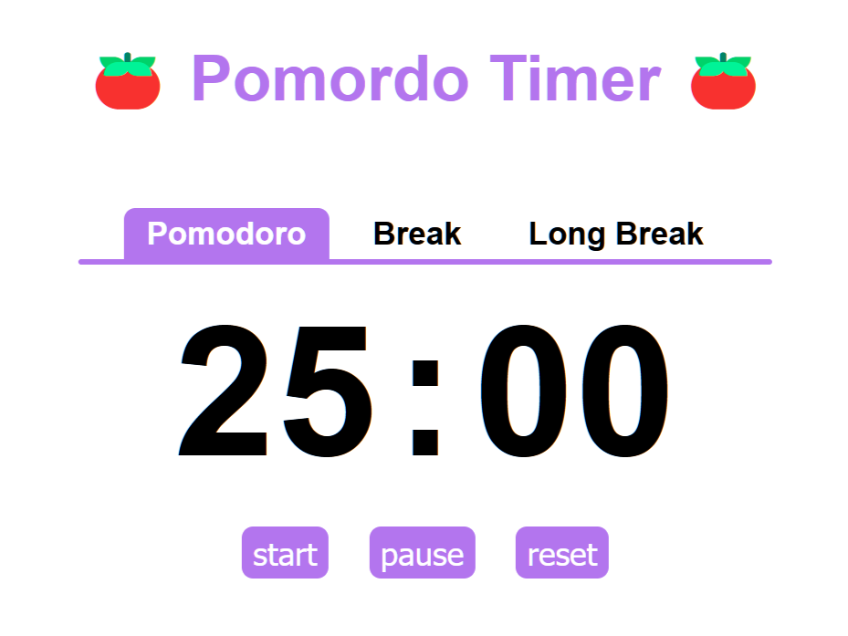

# Pomodoro Timer

This project is a timer for the Pomodoro method. The page counts down from 25, 15, or 5 minutes and plays a sound when the clock hits zero. Try it out for yourself [here](https://malachi3keys.github.io/pomodoro/).

## Pomodoro Technique

This method helps with focus and productivity. It works as follows: 

- Focus on a task for 25 minutes (pomodoro), then take a 5 minute break
- After completing 4 pomodoros, take a longer break of 15 minutes
- Don't forget to do some stretches during your breaks!